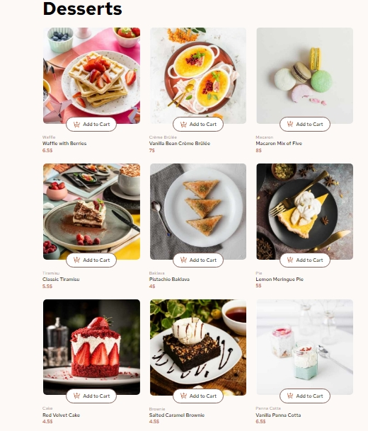

# Frontend Mentor - Product list with cart solution

This is a solution to the [Product list with cart challenge on Frontend Mentor](https://www.frontendmentor.io/challenges/product-list-with-cart-5MmqLVAp_d). Frontend Mentor challenges help you improve your coding skills by building realistic projects. 

## Table of contents

- [Overview](#overview)
  - [The challenge](#the-challenge)
  - [Screenshot](#screenshot)
  - [Links](#links)
- [My process](#my-process)
  - [Built with](#built-with)
- [Author](#author)

## Overview

### The challenge

Users should be able to:

- Add items to the cart and remove them
- Increase/decrease the number of items in the cart
- See an order confirmation modal when they click "Confirm Order"
- Reset their selections when they click "Start New Order"
- View the optimal layout for the interface depending on their device's screen size
- See hover and focus states for all interactive elements on the page

### Screenshot




### Links

- Solution URL: [Add solution URL here](https://github.com/dimitrisdr/product-list-with-cart-react.git)
- Live Site URL: [Add live site URL here](https://dimitrisdr.github.io/product-list-with-cart-react/)

## My process

### Built with

- Semantic HTML5 markup
- CSS custom properties
- Flexbox
- CSS Grid
- Mobile-first workflow
- [React](https://reactjs.org/) - JS library

### What I learned

```js
function App() {

  const [cartData, setCartData] = useState(startData)
  const dialogRef = useRef()

  function openDialog() {
    console.log('modal opened')
    dialogRef.current.showModal()
  }

  function closeDialog() {
    dialogRef.current.close()
    let newCartData = {...cartData}
    Object.keys(newCartData).forEach(key => newCartData[key].count = 0)
    setCartData(newCartData)
  }

  return (
    <>
    <DataContext.Provider value={{cartData, setCartData}}>
      <main className="main grid-item" style={{'--gap':'1.5rem'}}>
        <h1 className="main-title fw-700 fs-900">Desserts</h1>
            <section className="cards-container grid-item" aria-label='Product cards'>
              {data.map((item, i) => {return <Card key={i} item = {item} /> })}
            </section>
          </main>
          <Cart dialogFunc={openDialog} />
          <Dialog dialogRef={dialogRef} dialogFunc={closeDialog}/>
      </DataContext.Provider>
    </>
    
  )
}

export default App
```

## Author

- Frontend Mentor - [@yourusername](https://www.frontendmentor.io/profile/dimitrisdr)